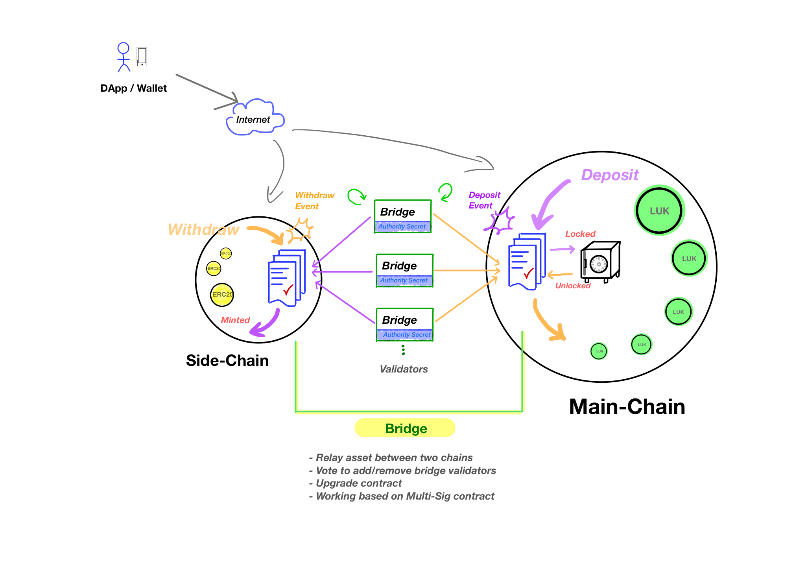
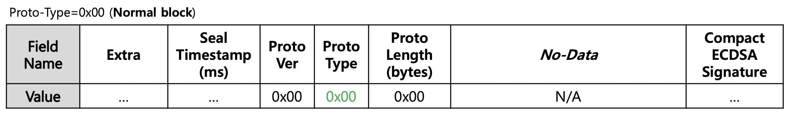
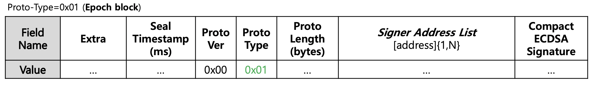
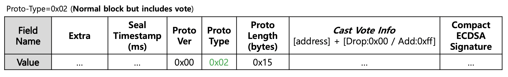

## Luniverse-PoA

Official golang implementation of the Luniverse-PoA protocol.
Current version of Luniverse-PoA is a forked from `go-ethereum` v1.10.15.
We would like to express best respect and gratitude to `go-ethereum` open source officials and many contributors.

## Build

Building Luniverse-PoA node executables, namely `bootnode` and `geth`, requires both a Go-Lang (version 1.20) and a C compiler.
You can install them using your favorite package manager or source tarball.

For golang 1.20 in linux, you can use the following link.
```
https://go.dev/dl/go1.20.linux-amd64.tar.gz
```

For compiler suite in Ubuntu, you can use the following command. In other systems, you need to check your package manager.
```bash
sudo apt-get install -y build-essential
```

Once the dependencies are installed, move to root directory of repository then run
```bash
$ make all
```

To build only p2p node, run
```bash
$ make geth
```

## Executables

Once you've completed a build step in previous section, several executables are created in the `build/bin` directory.
Although several excutables are available as a result of `make all`,
this guidance only focuses on following two main executables, namely `geth` and `bootnode`.

| Command    | Description |
|:----------:|-------------|
| `geth` | Executable for p2p node. By default Luniverse-PoA consensus protocol is enabled instead of Ethash PoW. It provides JSON RPC endpoints exposed on top of HTTP, WebSocket and/or IPC transports. |
| `bootnode` | Lightweight bootstrap node used to find neighbor nodes in same networks. |

## Running p2p nodes on your private network

Currently, we does not provide public testnet.

However, we have plan to provide public testnet to help anyone who want to test Luniverse-PoA protocol.

Here, it will be covered for beginner how to construct private network running Luniverse-PoA consensus.
For the simplicity of explanation, our private network will be consist of three kinds of nodes each having different roles like follows:

* bootnode x 1EA
* miner node x 1EA
* non-miner node x 1EA

*Note: Here we will assumes that all nodes are located in the same network and reachable each other. For example, all nodes have assigned same subnet address range and any firewall or anti-virus software is not the case of consideration.*

### Prepare keystore for the authority of miner node

First, install `keythereum` nodejs module using npm.
```bash
$ npm install keythereum --save
```
Using following code snippet you can create keystore for the authority of your private network.
And, resulted keystore is used to sign the block and cast vote to govern the membership of PoA network.
Note that it is compatible with Go-Ethereum keystore format and naming convention.
```javascript
const keythereum = require('keythereum');
  
const passphrase = 'changeit';

// Create private key
let dk = keythereum.create({ keyBytes: 32, ivBytes: 16 });

let options = {
  kdf: "scrypt",
  cipher: "aes-128-ctr",
  kdfparams: {
    dklen: 32,
    n: 262144,
    r: 8,
    p: 1
  }
};

// Create keystore content
let keystore = keythereum.dump(passphrase, dk.privateKey, dk.salt, dk.iv, options);

// Export keystore content to file
let keystoreAbsPath = keythereum.exportToFile(keystore, './');

console.log(keystoreAbsPath);
```

In Luniverse-PoA, especially for miner node, there are two configurable parameters need to be set correctly.

* `coinbase address`: Beneficiary account for any block rewards or gas fee
* `signer address`: Account who has authorized to sign and mint new block

You should know that **coinbase** address and **signer** address can be set independentely each other. Surely, it is possible to set those two addresses as same value, however it is recommended for miner node to set **signer** address value to account having long life.
This is because once **signer** address is enrolled as authorized one in network, it is impossible to change **signer** address without the authority vote between miners. On the other hand, **coinbase** address is usually required to be updated frequently if needed according to the miner's willing.


### Define genesis block

Luniverse-PoA protocol was designed to support two types of chain mode, namely `main-chain` mode and `side-chain` mode.
And chain mode is configurable by setting the certain options in **`genesis.json`** file and specifying argument to **`geth`** executable.

| Mode | Description |
|:---------:|-------------|
| `side-chain` | In Luniverse-PoA protocol, `side-chain` can be thought as an utility chain consists of some consortium members who has the authority to sign and verify block. It provides some features like `gas-free` for high usability and `short block time` for low response time. As you can expect, most of DApp transactions are executed in `side-chain`. As a result of optimization in block consensus protocol, practically it does not fall in reorganizaiton circumstance. It has no competition for propagation of new block, so it guarantees relatively high performance. It also provides some configurations for security as an compensation for `gas-free` enabled mode. |
| `main-chain` | In Luniverse-PoA protocol, `main-chain` can be thought as an value chain. Generally, there is one `main-chain` and many `side-chains` as a satellite chain aroud `main-chain`. And each `side-chain` is connected to `main-chain` logically via `bridge`. Here, `bridge` plays a role of relayer between two chains, namely `main-chain` and `side-chain`. According to the `Two Chain Layered Architecture` of Luniverse-PoA protocol, initially root level asset or value implemented by ERC20, ERC721, or any other means can be provisioned in `main-chain`. As time elapse and DApp users begins to be activated according to their crypto economy, asset or value in `main-chain` starts moving to `side-chain` or vice verse. Surely, asset or value in both chain can circulate inside itself. You shoud know that most of DApp transactions occur in `side-chain` layer, on the other hand most of value exchanges are occur in `main-chain` layer. |

<br/><br/>
Following figure illustrates _**Two-Chain Layered Architecture**_ of Luniverse-PoA.



We need a JSON file for genesis block of Luniverse-PoA network. Here is an example **genesis.json** file for `side-chain` mode.
As you can see, it is almost same with Ethereum's genesis block except some fields.

```json
{
  "config": {
    "chainId": 114175132,
    "homesteadBlock": 0,
    "eip150Block": 0, "eip155Block": 0,
    "eip158Block": 0,
    "byzantiumBlock": 0,
    "clique": {
      "period": 1,
      "epoch": 30000,
      "snapshot": 1024
    },
    "gasFree": {
      "payer": "0x8302168bd5138c8d3e0a8f1a09cc71a985029f86",
      "receiver": "0x8302168bd5138c8d3e0a8f1a09cc71a985029f86",
      "observer": "0x0000000000000000000000000000000000000000"
    }
  },
  "nonce": "0x0",
  "timestamp": "0x000000000001",
  "extraData": "0x000000000000000000000000000000000000000000000000000000000000000000000000000003e90001003cfaee496ec55247ecc7bf5af31007c265b308a0335a8894fa6e38a7761ff0a09e71dfe87733fccd6308c3cb9d8bcb9e85551611f87ce03ddd266372250000000000000000000000000000000000000000000000000000000000000000000000000000000000000000000000000000000000000000000000000000000000",
  "gasLimit": "64000000",
  "difficulty": "0x1",
  "mixHash": "0x0000000000000000000000000000000000000000000000000000000000000000",
  "coinbase": "0x0000000000000000000000000000000000000000",
  "number": "0x0",
  "gasUsed": "0x0",
  "parentHash": "0x0000000000000000000000000000000000000000000000000000000000000000",
  "alloc": {
    "0x8302168bd5138c8d3e0a8f1a09cc71a985029f86": {
        "balance": "20000000000000000000000"
    }
  }
}
```

You need to set some fields with your own value properly. Please refer following table for details.

| Field | Description |
|:---------:|-------------|
| `chainId` | Chain identifier. Set you own value. It should be positive number and you should know that some hardware wallet or wallet library does not support any number greater than 255 in terms of EIP155. |
| `clique.period` | Block time in second unit. For example, 1 means that new block is minted around every one second. |
| `gasFree.payer` | Gas fee payer account. If set, `gas-free` feature is enabled. Set an account address to pay the transaction fee for all transactions executed in the chain. In general, set `gasFree.payer` and `gasFree.observer` together. |
| `gasFree.receiver` | Gas fee collector account. If set, `gas-free` feature is enabled. Set an account address to receive transaction fees for all transactions executed in the chain. In general, set `gasFree.payer` and `gasFree.observer` together. |
| `gasFree.observer` | Currently not used. |
| `extraData` | In genesis block definition, this field is used to specify the list of account addresses of who has the authority to create a block. Any authorities listed here are subject to change as authority votes are taken between miners. |
| `alloc` | This field specifies the initial native coin balance or intial storage status value for a specific account. |


In particular, to extend and control the behavior of consensus related operations in protocol level, Luniverse-PoA protocol redefined and expand the `extraData` field of `clique` implementation of go-ethereum. The format is as follows.
The following is the definition of structure of extended `extraData` field.

| Name | Extra | Seal Timestamp (ms) | Proto Ver | Proto Type | Proto Length (bytes) | Signer List | Compact ECDSA Signature |
| :--: | :---: | :-----------------: | :-------: | :--------: | :------------------: | :---------: | :---------------------: |
| Bytes | 32 | 8 | 1 | 1 | 2 | 20 x N | 65 |

To briefly explain the configuration of `extraData` field, let's decode the data from the `genesis.json` example according to the structure definition of it.
Encoded value is given as follows:
```
"extraData": "0x000000000000000000000000000000000000000000000000000000000000000000000000000003e90001003cfaee496ec55247ecc7bf5af31007c265b308a0335a8894fa6e38a7761ff0a09e71dfe87733fccd6308c3cb9d8bcb9e85551611f87ce03ddd266372250000000000000000000000000000000000000000000000000000000000000000000000000000000000000000000000000000000000000000000000000000000000"
```

If you divide the string in hex according to the length of each field defined, it is as follows.
`0000000000000000000000000000000000000000000000000000000000000000`|`00000000000003e9`|`00`|`01`|`003c`|`faee496ec55247ecc7bf5af31007c265b308a0335a8894fa6e38a7761ff0a09e71dfe87733fccd6308c3cb9d8bcb9e85551611f87ce03ddd26637225`|`0000000000000000000000000000000000000000000000000000000000000000000000000000000000000000000000000000000000000000000000000000000000`

Here, you need to know that the value of the `Proto-Length` field representing the variable-length of following `Protocol-Data` in bytes is '0x003c' in hex representation, which means '60' bytes in length.
And moreover note that the value of `Proto-Type` field is 0x01. In current version of Luniverse-PoA, three kind of `Proto-Type` values are available, namely 0x00, 0x01, and 0x02. Here, 0x01 of `Proto-Type` means that the following `Protocol-Data` represents a `signer address list`. If you recall that EOA address is 20 bytes length, you can know that three EOA addresses are consecutive in the following `signer address list` field.

The following table describes each component of `extraData` based on the example we've just decoded.

| Field | Bytes | Description  |
|:----------------------------------|-------:|:-------------|
| Extra | 32 | Any extra data can be written this field.<br/><br/>_Example_: `0x0000000000000000000000000000000000000000000000000000000000000000` |
| Seal Timestamp (ms) | 8 | Timestamp in milliseconds unit when given block was sealed in miner side.<br/><br/>_Example_: `0x00000000000003e9` |
| Proto-Ver | 1 | Extended protocol version. Now is it reserved, so always set to '00'.<br/><br/>_Example_: `0x00` |
| Proto-Type | 1 | Extended protocol type. According to this value, structure of following two fields are determined.<br/>Currently three values are available for this field, 0x00, 0x01, and 0x02.<br/>For '0x00', it means that given block is normal block, so no extended data is considered.<br/>For '0x01', it means that given block is epoch block, so entire signers are listed.<br/>For '0x02', it means that given block is normal block but it also includes vote information too.<br/><br/>_Example_: `0x01` |
| Proto-Length | 2 | The lenght of following `Protocol-Data` field in bytes.<br/><br/>_Example_: `0x003c` |
| Proto-Data | 20*N | Any extended protocol data of arbitrary length. The actual structured data and total data length are determined by the preceeding `Proto-Type` and `Proto-Length` fields respectively.<br/>The above example value represents a hexadecimal string of contiguous concatenation of the address values of three signers.<br/><br/>_Example_: `0xfaee496ec55247ecc7bf5af31007c265b308a033` + `0x5a8894fa6e38a7761ff0a09e71dfe87733fccd63` + `0x08c3cb9d8bcb9e85551611f87ce03ddd26637225` |
| Compact ECDSA Signature | 65 | Miner's signature. Payload to signing operation is entire content of block header except this field.<br/><br/>_Example_: `0x0000000000000000000000000000000000000000000000000000000000000000000000000000000000000000000000000000000000000000000000000000000000` |

Please refer to the following figures for how the interpretation of `Proto-Length` and `Proto-Data` in `extraData` field may vary depending on the value of `Proto-Type`.





Finally, when defining your genesis block, the `extraData` field should be encoded to consist of the following:
1. `Proto-Type`: Set to **0x01**
2. `Proto-Data`: Encoding to include the list of signers to be initially registered
3. `Proto-Length`: Specifies the length of `Proto-Data`

### Setup & Run Bootnode
The bootnode plays a role of provisioning server that helps to find out the connection information for neighbor nodes existing on the network when the p2p nodes of the network are executed. The boodnode and p2p node are equipped with UDP based neighbor discovery protocol.

1. Install bootnode executable.
```bash
$ sudo cp /path/to/compiled/bootnode /usr/local/bin
```

2. Create root directory for bootnode.
```bash
$ mkdir -p ~/bootnode/logs
$ cd ~/bootnode
```

3. Generate key for bootnode.
```bash
$ bootnode -genkey bootnode.key
```

4. Prepare some shell variables for option flags. In this example, to reduce the vulnerability to your private network, we will restrict the network address range to its subnet only and change the default service port(i.e., UDP 30303) to 30307.
   For this, start extracting ip address of bootnode host. Following shows some examples in AWS ubuntu running environment.
```bash
# ubuntu 16.04
$ export BOOTNODE_IP=$(ifconfig | grep -E 'eth0|ens' -A1 | grep 'inet addr' | awk '{ print $2 }' | awk -F':' '{ print $2 }')
```
```bash
# ubuntu 18.04
$ export BOOTNODE_IP=$(ifconfig | grep -E 'eth0|ens' -A1 | grep 'inet' | awk '{ print $2 }')
```
Then prepare CIDRs for your subnet.
```bash
$ export BOOTNODE_CIDRS=$(echo $ip | awk -F. '{printf "%s.%s.%s.0/24", $1, $2, $3}')
```

5. Run `boonode` executable with flags.
```bash
$ nohup bootnode --netrestrict=$BOOTNODE_CIDRS -nat none -addr $BOOTNODE_IP:30307 -verbosity 9 -nodekey bootnode.key > logs/bootnode.log 2>&1 &
```

5. Extract `enode` information. You should know that `enode` value obtained here will be used in running p2p node later.
```bash
$ grep '=enode' logs/bootnode.log | awk -F= '{print $2}'
enode://d625da2dfaab064a080c39fda06426c6d27e92c1ef62fb71453283adb4b509dfe714df217e568fc5fb00fc1d70085802305bb4a2886f454f25bfe12768fe1c81@10.30.67.198:30307 
```

### Setup & Run Miner node
In Luniverse-PoA protocol, minor is a node that has the authority to create blocks in the network. This block creation authority can be proved by signing the block header contents using the privateKey held by the miner node when the block is created, and the rest of nodes in network that receives propagated block verifies the signature in `extraData` of block header. Espeically, authority list of nodes that can sign and propagate new blocks is always maintained in on-chain storage. Therefore, any block signed by a node that is not included in the authority list is never accepted. After all, to run a minor node, a privateKey value to sign the block header is required. To do this, we can use the `--signer` and `--unlock` options of the `geth` command to pass the signing EOA address of the miner and the passphrase value of the keystore file that protects the privateKey of the signing EOA.

1. Install `geth` executable.
```bash
$ sudo cp /path/to/compiled/geth /usr/local/bin
```

2. Create root directory for block data, logs, and your secret files.
```bash
$ mkdir -p ~/data/logs
$ cd ~/data
```

3. Initialize p2p node.
```bash
$ geth --datadir ~/data init /path/to/your/genesis.json
```

4. Copy keystore files for your authority and prepare protected secret file for passphrase of your keystore.
   You are creating your own private Luniverse-PoA network running in `side-chain` mode, so only keystore file for `signer authority` is sufficient. (c.f., For `main-chain` mode, additional beneficiary accout address is also required)
```bash
$ cp /path/to/your/keystore ~/data/keystore
```
Create any hidden file and write down your passphrase in it. Then execute _chmod_ to protect it.
```bash
$ echo 'set_your_passphrase' > .passphrase
$ chmod 0400 .passphrase
```

5. Prepare some shell variables for option flags. You need to set beneficiary address, signer address, and `enode` value of bootnode. For beneficiary address, you can just use `gasFree.payer` instead of it. For signer address, you must use account which will be assigned authority for this miner node. You can find signer address from keystore that you've created previous step.
```bash
$ export POA_BENEFICIARY=0x8302168bd5138c8d3e0a8f1a09cc71a985029f86
$ export POA_SIGNER_ADDR=0xfaee496ec55247ecc7bf5af31007c265b308a033
$ export POA_BOOTNODES=enode://d625da2dfaab064a080c39fda06426c6d27e92c1ef62fb71453283adb4b509dfe714df217e568fc5fb00fc1d70085802305bb4a2886f454f25bfe12768fe1c81@10.30.67.198:30307
```

6. Run `geth` executable with flags.
```bash
$ nohup geth \
    --datadir=~/data \
    --networkid=12345 \
    --gasprice=5000 \
    --syncmode=full \
    --mine \
    --txpool.nolocals=true \
    --etherbase=$POA_BENEFICIARY \
    --signer=$SIGNER_ADDR \
    --unlock=$SIGNER_ADDR \
    --password=~/data/.passphrase \
    --bootnodes=$POA_BOOTNODES \
    --rpc --rpcaddr 0.0.0.0 \
    --rpcapi='eth,web3,net' \
    --rpccorsdomain='*' \
    --rpcvhosts='*' \
    --ws \
    --wsorigins '*' \
    --wsaddr 0.0.0.0 \
    --wsapi='eth,web3,net' \
    --vmodule=p2p=1 \
    >> ~/data/logs/geth.log \
    2>&1 &
```


### Setup & Run Non-miner node
In the case of non-miner node, unlike the miner node, it is a node that does not participate in block generation and just plays a role of relaying and verifying a block. Since no block generation is performed, there is no need to pass a private key for signing EOA to run a non-miner node.

1. Install `geth` executable.
```bash
$ sudo cp /path/to/compiled/geth /usr/local/bin
```

2. Create root directory for block data and logs.
```bash
$ mkdir -p ~/data/logs
$ cd ~/data
```

3. Initialize p2p node. You must use the same `genesis.json` file that was used in miner setup in previous section.
```bash
$ geth --datadir ~/data init /path/to/your/genesis.json
```

4. Prepare some shell variables for option flags.
```bash
$ export POA_BOOTNODES=enode://b85380cd1eaf2f445383117c3899df26bc4ac297b5b84eef47f05ac78eca5258c40b3f6752f5f28b64471c8c980d56bcb18036536705ffd408a373560cb6a8ed@10.10.51.20:30302,enode://836d8e88a30707d33637506ad95a840a33fe8e1bccf289205242fabc15ac599868cadb646a9650e50945e689218edc95fc6b0acf455dcad5f6e9191ebffd6406@10.10.52.153:30302
```

5. Run `geth` executable with flags.
```bash
$ nohup geth \
    --datadir=~/data \
    --networkid=12345 \
    --gasprice=5000 \
    --syncmode=full \
    --txpool.nolocals=true \
    --bootnodes=$POA_BOOTNODES  \
    --rpc --rpcaddr 0.0.0.0 \
    --rpcapi='eth,web3,net' \
    --rpccorsdomain='*' \
    --rpcvhosts='*' \
    --ws \
    --wsorigins '*' \
    --wsaddr 0.0.0.0 \
    --wsapi='eth,web3,net' \
    --vmodule=p2p=1 \
    >> ~/data/logs/geth.log \
    2>&1 &
```

### Programatically interacting with p2p nodes

Developers or DApp can interact with Luniverse-PoA running miner or non-miner node through JSON-RPC APIs.
As you can expect, using the JSON-RPC API is the same as go-ethereum.

The standard JSON-RPC API specifications supported by go-ethereum can be found at the following link:
- [General APIs for DApps](https://github.com/ethereum/wiki/wiki/JSON-RPC)
- [Management or internal APIs for developer or system](https://github.com/ethereum/go-ethereum/wiki/Management-APIs)

#### Security consideration in RPC service
Followings are cited from official go-ethereum GitHub. It introduces general guidances about the security consideration in operating the p2p node exposing RPC service.

JSON-RPC APIs are exposed via HTTP, WebSockets and IPC (unix sockets on unix based platforms, and named pipes on Windows).

The IPC interface is enabled by default and exposes all the APIs supported by Geth, whereas the HTTP
and WS interfaces need to manually be enabled and only expose a subset of APIs due to security reasons.
These can be turned on/off and configured as you'd expect.

HTTP based JSON-RPC API options:

* `--rpc` Enable the HTTP-RPC server
* `--rpcaddr` HTTP-RPC server listening interface (default: "localhost")
* `--rpcport` HTTP-RPC server listening port (default: 8545)
* `--rpcapi` API's offered over the HTTP-RPC interface (default: "eth,net,web3")
* `--rpccorsdomain` Comma separated list of domains from which to accept cross origin requests (browser enforced)
* `--ws` Enable the WS-RPC server
* `--wsaddr` WS-RPC server listening interface (default: "localhost")
* `--wsport` WS-RPC server listening port (default: 8546)
* `--wsapi` API's offered over the WS-RPC interface (default: "eth,net,web3")
* `--wsorigins` Origins from which to accept websockets requests
* `--ipcdisable` Disable the IPC-RPC server
* `--ipcapi` API's offered over the IPC-RPC interface (default: "admin,debug,eth,miner,net,personal,shh,txpool,web3")
* `--ipcpath` Filename for IPC socket/pipe within the datadir (explicit paths escape it)

You'll need to use your own programming environments' capabilities (libraries, tools, etc) to connect
via HTTP, WS or IPC to a Geth node configured with the above flags and you'll need to speak [JSON-RPC](http://www.jsonrpc.org/specification)
on all transports. You can reuse the same connection for multiple requests!

**Note: Please understand the security implications of opening up an HTTP/WS based transport before
doing so! Hackers on the internet are actively trying to subvert Ethereum nodes with exposed APIs!
Further, all browser tabs can access locally running webservers, so malicious webpages could try to
subvert locally available APIs!**


## Contribution

If you'd like to contribute to Luniverse-PoA protocol, please fork, fix, commit and send a pull request
for the maintainers to review and merge into the main code base. If you wish to submit more
complex changes though, please check up with the core devs first on [our gitter channel](https://gitter.im/Lambda256/luniverse-poa)
to ensure those changes are in line with the general philosophy of the project and/or get some
early feedback which can make both your efforts much lighter as well as our review and merge
procedures quick and simple.

Please make sure your contributions adhere to our coding guidelines:

* Code must adhere to the official Go [formatting](https://golang.org/doc/effective_go.html#formatting) guidelines (i.e. uses [gofmt](https://golang.org/cmd/gofmt/)).
* Code must be documented adhering to the official Go [commentary](https://golang.org/doc/effective_go.html#commentary) guidelines.
* Pull requests need to be based on and opened against the `master` branch.
* Commit messages should be prefixed with the package(s) they modify.
   * E.g. "eth, rpc: make trace configs optional"

## License

As mentioned at the outset, the project is a derivative version of the very popular go-ethereum official open source project, so the basic licensing policy is entirely the same as that of the go-ethereum project.

The original go-ethereum library and any changes made by Luniverse-PoA protocol (i.e. all code outside of the `cmd` directory) are licensed under the
[GNU Lesser General Public License v3.0](https://www.gnu.org/licenses/lgpl-3.0.en.html), also
included in our repository in the `COPYING.LESSER` file.

The original go-ethereum binaries and any changes made by Luniverse-PoA protocol (i.e. all code inside of the `cmd` directory) are licensed under the
[GNU General Public License v3.0](https://www.gnu.org/licenses/gpl-3.0.en.html), also included
in our repository in the `COPYING` file.